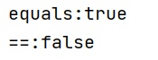

# equals 与 ==的区别 ：==是运算符，equal是方法

# equals方法的作用

  1、默认情况（没有覆盖equals方法）下equals方法都是调用Object类的equals方法，而Object的equals方法主要用于判断对象的内存地址引用是不是同一个地址（是不是同一个对象）。

2 、要是类中覆盖了equals方法，那么就要根据具体的代码来确定equals方法的作用了，覆盖后一般都是通过对象的内容是否相等来判断对象是否相等。

# 常见的几种情况下equals 与 ==

## 比较基本类型

Java基本类型：8种（int short long byte float double boolean char）

只能用==，不能用equals，这里的==比较的是两个变量的值。

## 比较包装类型

==比较的内存地址，new出来的对象地址不同。

equals比较的是值

```java
Integer integer1 = new Integer(1);
Integer integer2 = new Integer(1);
System.out.println("equals:"+integer1.equals(integer2));
System.out.println("==:"+(integer1 == integer2));
```




## 比较String类型

==比较的是内存地址，equals比较的是值

```java
//String
String str1 = "Hello";
String str2 = new String("Hello");
String str3 = str2; // 引用传递，同一对象
String str4 = new String("Hello");
String str5 = "Hello";
System.out.println(str1 == str2); // false（str2是new的一个新地址）
System.out.println(str1 == str3); // false（str3和str2内存地址一样，和str1地址不同）
System.out.println(str2 == str3); // true（引用str2，地址相同）
System.out.println(str1 == str5); // true（String作为基本类型，没创建新地址）
System.out.println(str4 == str2); // false（内存地址不同）
System.out.println(str1.equals(str2)); // true（内容一致，都是“hello”）
System.out.println(str1.equals(str3)); // true（内容一致，都是“hello”）
System.out.println(str2.equals(str3)); // true（内容一致，都是“hello”）
System.out.println(str2.equals(str4)); // true（内容一致，都是“hello”）
System.out.println(str1.equals(str5)); // true（内容一致，都是“hello”）
```

## 比较对象类型

==和equals比较的都是内存地址，因为没有equals没有被重写。默认是Object类的equals方法。

如果对象类重写了equals方法，equals比较的就是值。

# hashCode与equals方法的关系

## 为什么覆盖(不是重载)equals方法一定要覆盖hashCode方法

因为如果只覆盖了equals而没有覆盖hashCode, 则两个不同的instance a和b 虽然equals结果(业务逻辑上)相等,但却会有不同的hashcode,这样hashmap里面会同时存在a和b,而实际上我们需要hashmap里面只能保存其中一个,因为从业务逻辑方向看它们是相等的. 

equals方法和hashCode方法如果不同时按你自己逻辑覆盖的话，HashMap就会出问题。

比如你只覆盖了equals方法而没有覆盖hashCode方法，那么HashMap在第一步寻找链表的时候会出错，有同样值的两个对象Key1和Key2并不会指向同一个链表或桶，因为你没有提供自己的hashCode方法，那么就会使用**Object的hashCode方法，该方法是根据内存地址来比较两个对象是否一致**，由于Key1和Key2有不桶的内存地址，所以会指向不同的链表，这样HashMap会认为key2不存在，虽然我们期望Key1和Key2是同一个对象；

反之如果只覆盖了hashCode方法而没有覆盖equals方法，那么虽然第一步操作会使Key1和Key2找到同一个链表，但是由于equals没有覆盖，那么在遍历链表的元素时，key1.equals(key2)也会失败(事实上Object的equals方法也是比较内存地址)，从而HashMap认为不存在Key2对象，这同样也是不正确的。

```java
public class Student {
    private String name;
    private String age;
    public String getName() {
        return name;
    }

    public void setName(String name) {
        this.name = name;
    }

    public String getAge() {
        return age;
    }

    public void setAge(String age) {
        this.age = age;
    }
    @Override
    public boolean equals(Object o) {
        if (this == o) return true;
        if (o == null || getClass() != o.getClass()) return false;

        Student student = (Student) o;

        if (name != null ? !name.equals(student.name) : student.name != null) return false;
        return age != null ? age.equals(student.age) : student.age == null;
    }

    @Override
    public int hashCode() {
        int result = name != null ? name.hashCode() : 0;
        result = 31 * result + (age != null ? age.hashCode() : 0);
        return result;
    }
}
```

```java
LinkedList<Student> list = new LinkedList<Student>();
Set<Student> set = new HashSet<Student>();
Student stu1 = new Student("张三", "17");
Student stu2 = new Student("张三", "17");
System.out.println("stu1 == stu2 : " + (stu1 == stu2));
System.out.println("stu1.equals(stu2) : " + stu1.equals(stu2));
list.add(stu1);
list.add(stu2);
System.out.println("list size:" + list.size());
System.out.println(stu1.hashCode());
System.out.println(stu2.hashCode());
set.add(stu1);
set.add(stu2);
System.out.println("set size:" + set.size());
```

### 覆盖equals没有覆盖hashCode，hashCode不相等


### 没有覆盖equals覆盖hashCode，equals为false


### 覆盖equals覆盖hashCode，set集合的个数为一，说明是同一个对象。


## 总结

> 将对象放入到集合中时，**首先判断要放入对象的hashcode值**与集合中的任意一个元素的hashcode值是否相等，如果不相等直接将该对象放入集合中。如果hashcode值相等，然后**再通过equals方法判断**要放入对象与集合中的任意一个对象是否相等，如果equals判断不相等，直接将该元素放入到集合中，否则不放入。

参考：

https://www.cnblogs.com/zhuyeshen/p/10954275.html

https://blog.csdn.net/u012056417/article/details/54110314